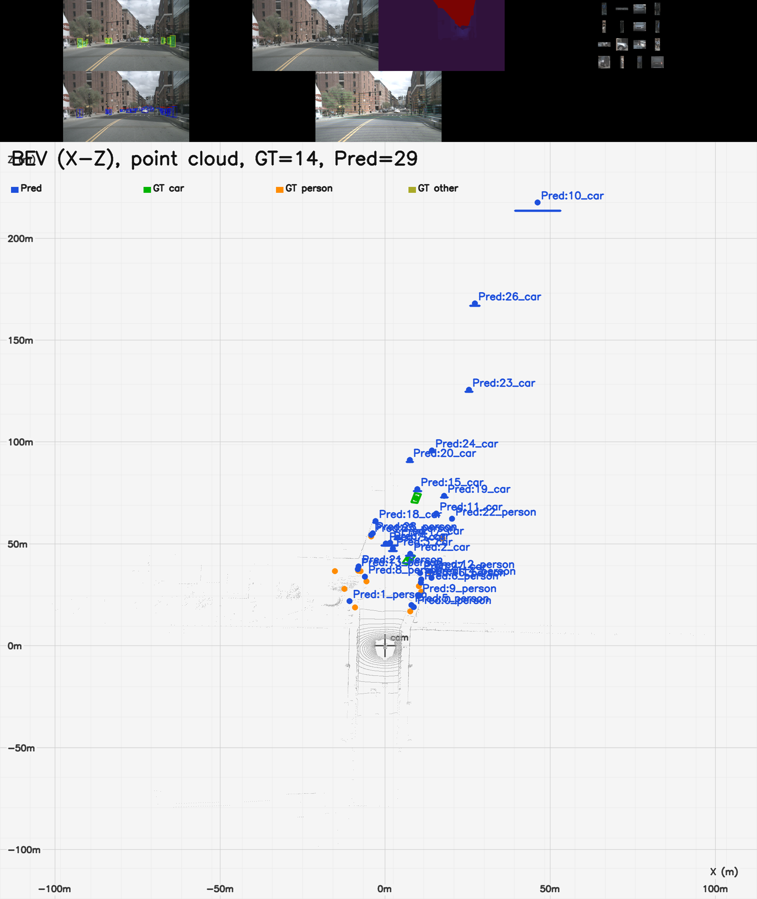

## What changed in this fork

Based on [UVA LabelAny3D](https://github.com/UVA-Computer-Vision-Lab/LabelAny3D). **The original COCO + MoGe/DepthPro pipeline is unchanged**; we add optional ways to supply **metric depth from real LiDAR** and to run on **nuScenes via py123d**, without retraining the core 3D models.

### Highlights

| Change | What it does |
|--------|----------------|
| **Four depth backends** | `estimate` \| `lidar` \| `py123d` \| **`fuse`** (LiDAR metric + MoGe/DepthPro hole fill) — same downstream layout |
| **Fuse depth** | Keep projected LiDAR where valid; fill holes with aligned vision depth (`fuse_align: true`) |
| **Fuse refinements (1–7)** | Soft blend, banded scale, median raster+densify, semantic priors, multi-view refine, edge fill, calib `(du,dv)` |
| **Custom LiDAR** | Manifest + calib JSON → `depth_map.npy`, PLY, `cam_params.json` ([guide](docs/LIDAR_INPUT.md)) |
| **py123d + nuScenes** | Arrow logs → depth + projected 3D-box masks (`nuscenes_annotations.json`) for crops ([guide](docs/PY123D_NUSCENES.md)) |
| **LocateAnything detector** | VLM 2D detection via `segmentation.holistic: locateanything` + `run_locateanything` wrapper |
| **Crop refinement** | OneFormer semantic masks **inside** LocateAnything 2D box crops (`crop_refinement: oneformer`) |
| **Depth-fallback 3D** | Unreconned crops → `3dbbox` via depth (`source: depth_fallback`) so Pred BEV covers LA detections |
| **Skip finished scenes** | Resume when `depth_map.npy` + `cam_params.json` already exist |
| **Sparse LiDAR** | `--depth_fill nearest` fills empty depth pixels before alignment |
| **CPU smoke tests** | `test_lidar_depth_smoke.py` (incl. fuse align), `test_py123d_coord.py`, `test_py123d_annotations.py` |
| **Scene visualization** | Surround cams around BEV; `--bev_extent=-50,50,-50,100`; `compose` stitches all panels |
| **Summary video** | `render_summary_video.py`: consecutive-frame summaries → **2 Hz** MP4 |
| **GT 3D boxes (py123d)** | `nuscenes_gt_3dbbox.json` per scene; BEV GT footprints without text labels |
| **Model-based crops** | `detection_source: model` with **EntityV2**, **OneFormer**, or **[LocateAnything](https://research.nvidia.com/labs/lpr/locate-anything/)**; category filter via `allowed_categories` |

### New / modified files (fork)

```
src/geometry/lidar_depth.py          # LiDAR → depth_map / PLY / cam_params
src/batch_scripts/lidar_loader.py
src/batch_scripts/py123d_loader.py
src/integrations/py123d/              # nuScenes adapter (coord, annotations, loader)
src/configs/lidar.yaml
src/configs/py123d_nuscenes.yaml
src/configs/py123d_nuscenes_smoke.yaml
src/configs/py123d_nuscenes_fuse.yaml
src/configs/py123d_nuscenes_locateanything.yaml
src/integrations/locateanything/       # parser, worker, detect
requirements-locateanything.txt
src/batch_scripts/pipeline_loader.py
src/batch_scripts/run_nuscenes.py
src/tools/visualize_scene.py
src/tools/render_summary_video.py      # multi-frame summary → 2 Hz video
docs/LIDAR_INPUT.md
docs/PY123D_NUSCENES.md
docs/NUSCENES_EXPERIMENT.md
scripts/run_nuscenes.sh
scripts/mirrors_cn.sh                  # domestic PyPI / HF / GitHub mirrors
requirements-py123d.txt                # optional: pip install -r requirements-py123d.txt
env.sh                                 # helper to activate la3d env + CUDA toolchain
```

Modified: `src/batch_scripts/depth.py`, `src/batch_scripts/get_crops_enhanced.py`, `src/dataset_model/BaseScene.py`, `PointCloudScene.py`

### Depth step at a glance

| Mode | When to use | Key command |
|------|-------------|-------------|
| `estimate` | Original COCO / in-the-wild (MoGe + DepthPro) | `python batch_scripts/depth.py --split val` |
| `lidar` | You have RGB + world-frame point cloud + calibration | `--depth_source lidar --manifest .../manifest.json` |
| `py123d` | nuScenes (or other sets) already converted with [py123d](https://github.com/kesai-labs/py123d) | `--depth_source py123d --config configs/py123d_nuscenes.yaml` |
| `fuse` | nuScenes / LiDAR scenes: metric LiDAR + dense vision fill | `run.depth.source: fuse` in config, or `--depth_source fuse` |

**Fuse logic** (`src/geometry/lidar_depth.py`): rasterize LiDAR → optional hole fill → MoGe+DepthPro dense estimate → RANSAC / banded scale on overlap → soft-blend LiDAR with aligned vision depth → optional multi-view / edge / calib refine. Toggle flags live under `run.depth.*` in `py123d_nuscenes_fuse.yaml` / `locateanything` configs.

All modes write the **same scene layout** (`input.png`, `depth_map.npy`, `cam_params.json`, …) so `enhance.py` → `whole.py` stay compatible.

---

## Quick start (fork features)

Run from the `src/` directory after [installation](docs/INSTALL.md).

**1. Custom LiDAR (manifest)**

```bash
python batch_scripts/depth.py \
  --depth_source lidar \
  --manifest ../dataset/lidar/manifest.json \
  --config configs/lidar.yaml \
  --save_dir ../experimental_results/LiDAR/ \
  --start_index 0 --end_index -1
```

**2. py123d nuScenes (one command)**

```bash
pip install -r requirements-py123d.txt
export PY123D_DATA_ROOT=/path/to/py123d_data

cd src
python batch_scripts/run_nuscenes.py --preset smoke --skip_existing --visualize after_depth
```

**3. LocateAnything + fuse depth (smoke)**

```bash
pip install -r requirements-py123d.txt
pip install -r requirements-locateanything.txt   # optional VLM deps
source env.sh
export PY123D_DATA_ROOT=/path/to/py123d_data
export HF_ENDPOINT=https://hf-mirror.com          # optional mirror
export LOCATEANYTHING_ATTN=sdpa                   # or flash on supported GPUs
export SMOKE_MAX_RECON_OBJECTS=8                  # optional recon cap for smoke

cd src
python batch_scripts/run_nuscenes.py \
  --preset locateanything \
  --save_dir ../experimental_results/nuScenes_smoke_locateanything \
  --py123d_dataset nuscenes-mini \
  --visualize all
```

Preset `locateanything` → `configs/py123d_nuscenes_locateanything.yaml`:
- `depth.source: fuse` — LiDAR prior + MoGe/DepthPro fill
- `segmentation.holistic: locateanything` — VLM 2D boxes
- `segmentation.crop_refinement: oneformer` — semantic mask per crop (not full image)

**4. Visualization**

```bash
python tools/visualize_scene.py \
  --root ../experimental_results/nuScenes/nuscenes_val \
  --mode compose \
  --bev_extent=-50,50,-50,100
```

`compose` builds `viz/summary.png` with **surround cameras arranged around a center BEV** (front / side / back rings). Each camera stacks GT / Pred-2D / depth; BEV uses a meter grid (GT by color, Pred in blue). Prefer `--bev_extent=-50,50,-50,100` (equals form) so argparse does not treat leading `-` as flags.

**5. Summary video (consecutive frames @ 2 Hz)**

```bash
source ../env.sh
cd src
python tools/render_summary_video.py \
  --save_dir ../experimental_results/nuScenes_summary_video \
  --num_frames 50 --fps 2 --scene_index 0 \
  --bev_extent=-50,50,-50,100
```

Renders lightweight per-frame summaries (LiDAR depth + GT crops + depth-fallback 3D boxes) and stitches them into an MP4. `nuscenes-mini` scenes usually have ~40 keyframes; the script caps automatically.

Pipeline order: `depth` → `enhance` → `crops` → `completion` → `elevation` → `reconstruction` → `whole`. All nuScenes steps use `--data_backend py123d`.

Details: [nuScenes experiment](docs/NUSCENES_EXPERIMENT.md) · [COCO Pipeline](docs/COCO_PIPELINE.md) · [LiDAR](docs/LIDAR_INPUT.md) · [py123d nuScenes](docs/PY123D_NUSCENES.md)

### nuScenes smoke visualization

One-scene `nuscenes-mini` smoke run with **fuse depth** (LiDAR + MoGe/DepthPro), **LocateAnything** 2D detection, **OneFormer crop refinement** (`car` / `person`), and **GT + predicted 3D boxes** in BEV.



Layout: surround cameras around center BEV (GT / Pred-2D / depth per cam); BEV meter grid with colored GT and blue Pred.

Older examples: [OneFormer smoke](docs/assets/nuscenes_oneformer_smoke_summary.png) · [summary](docs/assets/nuscenes_smoke_summary.png) · [mesh](docs/assets/nuscenes_mesh_overlay.png) · [BEV](docs/assets/nuscenes_bev_3d.png)

### Recent updates (2026-07)

| Area | Summary |
|------|---------|
| **Fuse refinements** | Soft blend, banded scale align, median raster+densify, semantic sky/ground priors, multi-view surround refine, edge-aware fill, calib `(du,dv)` |
| **Depth-fallback 3D** | `whole.py` / `util_3dbox.save_3d_bbox_from_depth_fallback` for unreconned crops beyond `SMOKE_MAX_RECON_OBJECTS` |
| **Surround summary** | Cameras ringed around BEV; configurable `--bev_extent` / `LA3D_BEV_EXTENT` |
| **Summary video** | `tools/render_summary_video.py` — consecutive frames → 2 Hz MP4 |
| **Env / mirrors** | `env.sh` + `scripts/mirrors_cn.sh` for domestic PyPI/HF and CUDA toolchain defaults |

### Earlier updates (2026-06)

| Area | Summary |
|------|---------|
| **Fuse depth** | `depth_source: fuse` for py123d/manifest; `fuse_lidar_with_estimate()` + RANSAC `apply_mask` fix (scale applied to all estimate pixels, not only LiDAR hits) |
| **LocateAnything** | `src/integrations/locateanything/` — parser, worker, `detect_boxes()`; wired in `get_crops_enhanced.py` and `model_wrappers.py` |
| **Crop workflow** | LA holistic detect → padded crop → OneFormer refine → paste mask; box-mask fallback when refine is empty |
| **run_nuscenes** | `--preset locateanything`; depth `source`/`fill` read from config (not hardcoded `py123d`) |
| **Visualization** | BEV meter grid (`X (m)` / `Z (m)`), camera origin marker; `DEFAULT_COMPOSE_MODES` for stable `summary.png` layout |
| **Robustness** | DepthPro `f_px` tensor fix; `whole.py` depth fallback when meshes lack textures; `SMOKE_MAX_RECON_OBJECTS` env cap |

---

## Environment verification (2026-05-27)

The environment in this workspace has been validated end-to-end with the following setup:

- Conda env: `la3d` (`python=3.10`)
- PyTorch: `2.2.2+cu121`
- Optional acceleration packages: `flash-attn==2.7.4.post1`, `xformers==0.0.25.post1`, `kaolin==0.17.0`
- TRELLIS deps verified: `spconv`, `nvdiffrast`, `pytorch3d`, `detectron2`

### Activate the environment

```bash
source env.sh
cd src
```

### TRELLIS offline smoke test (local snapshot)

If your network is restricted, run TRELLIS from a local Hugging Face snapshot:

```bash
cd external/TRELLIS
HF_HUB_OFFLINE=1 TRANSFORMERS_OFFLINE=1 python - <<'PY'
import os
os.environ['ATTN_BACKEND'] = 'xformers'
os.environ['SPCONV_ALGO'] = 'native'
from PIL import Image
from trellis.pipelines import TrellisImageTo3DPipeline

model_path = '/root/.cache/huggingface/hub/models--JeffreyXiang--TRELLIS-image-large/snapshots/25e0d31ffbebe4b5a97464dd851910efc3002d96'
pipeline = TrellisImageTo3DPipeline.from_pretrained(model_path)
pipeline.cuda()
outputs = pipeline.run(
    Image.open('assets/example_image/T.png'),
    seed=1,
    sparse_structure_sampler_params={'steps': 1, 'cfg_strength': 1.0},
    slat_sampler_params={'steps': 1, 'cfg_strength': 1.0},
)
print(outputs.keys())
PY
```

Expected output keys include: `mesh`, `gaussian`, `radiance_field`.

---

## Documentation

| Guide | Content |
|-------|---------|
| [INSTALL.md](docs/INSTALL.md) | Environment, checkpoints, TRELLIS / external deps |
| [COCO_PIPELINE.md](docs/COCO_PIPELINE.md) | Original 8-step COCO pipeline |
| [LIDAR_INPUT.md](docs/LIDAR_INPUT.md) | Manifest format, calib JSON, coordinate frames |
| [PY123D_NUSCENES.md](docs/PY123D_NUSCENES.md) | `PY123D_DATA_ROOT`, conversion, py123d CLI |
| [NUSCENES_EXPERIMENT.md](docs/NUSCENES_EXPERIMENT.md) | `run_nuscenes.py`, presets, visualization |

---

## Deployment notes (optional)

For clusters or production:

- Centralize paths with env vars (`LA3D_ROOT`, `LA3D_CHECKPOINTS`, `HF_HOME`, `PY123D_DATA_ROOT`)
- Shard jobs with `--start_index` / `--end_index` (see SLURM example in [COCO_PIPELINE.md](docs/COCO_PIPELINE.md))
- Prefer **Linux + NVIDIA GPU**; use WSL2 on Windows
- Consider Docker + offline checkpoint bundles for air-gapped installs ([INSTALL.md](docs/INSTALL.md))

---

## Original project

### COCO3D dataset

The evaluation set of COCO3D and pseudo-labeled training set are available at [Hugging Face](https://huggingface.co/datasets/uva-cv-lab/COCO3D).

### 3D bbox human refinement interface

Source code: https://github.com/UVA-Computer-Vision-Lab/3d_annotator

### OVMono3D fine-tuning

https://github.com/UVA-Computer-Vision-Lab/LabelAny3D/tree/ovmono3d_finetune

---

## Citing

If you find this work useful for your research, please kindly cite:

```BibTeX
@inproceedings{yao2025labelany3d,
  title={LabelAny3D: Label Any Object 3D in the Wild},
  author={Jin Yao and Radowan Mahmud Redoy and Sebastian Elbaum and Matthew B. Dwyer and Zezhou Cheng},
  booktitle={Neural Information Processing Systems (NeurIPS)},
  year={2025}
}

@inproceedings{yao2025open,
  title={Open Vocabulary Monocular 3D Object Detection},
  author={Yao, Jin and Gu, Hao and Chen, Xuweiyi and Wang, Jiayun and Cheng, Zezhou},
  booktitle={Proceedings of the International Conference on 3D Vision (3DV)},
  year={2026}
}
```

## Acknowledgements

This work builds on many open-source projects:

- [Gen3DSR](https://github.com/AndreeaDogaru/Gen3DSR) — 3D reconstruction framework
- [TRELLIS](https://github.com/microsoft/TRELLIS) — 3D asset generation
- [MoGe](https://github.com/microsoft/MoGe) — Monocular geometry estimation
- [DepthPro](https://github.com/apple/ml-depth-pro) — Metric depth estimation
- [MASt3R](https://github.com/naver/mast3r) — Dense matching
- [InvSR](https://github.com/zsyOAOA/InvSR) — Image super-resolution
- [COCONUT](https://github.com/bytedance/coconut_cvpr2024) — COCO segmentation annotations
- [OVMono3D](https://github.com/UVA-Computer-Vision-Lab/ovmono3d) — Open vocabulary monocular 3D detection
- [py123d](https://github.com/kesai-labs/py123d) — Unified autonomous driving data API (optional adapter in this fork)

## License

This project is licensed under the [MIT License](LICENSE).

[jy]: https://yaojin17.github.io
[rr]: https://scholar.google.com/citations?user=066_RcMAAAAJ&hl=en
[se]: https://www.cs.virginia.edu/~se4ja/
[md]: https://matthewbdwyer.github.io/
[zc]: https://sites.google.com/site/zezhoucheng/
